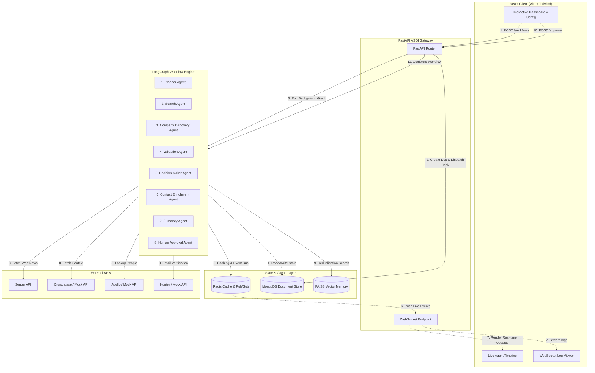

# AgentSphere AI

AgentSphere AI is an enterprise-grade agentic B2B customer discovery and prospect intelligence platform. By combining stateful multi-agent graphs with strict human-in-the-loop safety checkpoints, AgentSphere AI automatically identifies qualified target organizations, extracts relevant buying personas, enriches contact details, and compiles structured sales briefs.

---

## 🏗️ Architecture Topology



---

## 🌟 Key Features

*   **Stateful Multi-Agent Workflows:** Orchestrates 8 specialized agent nodes using a state-sharing graph topology that allows conditional routing, fallback scenarios, and failure recovery.
*   **Real-time Log & Timeline Streaming:** Provides immediate feedback in the frontend with a live agent execution timeline and console log stream powered by WebSockets and a Redis Pub/Sub event bus.
*   **Human-in-the-Loop Safeguards:** Enforces an approval barrier where users can review, edit, reject, or approve discovered contacts before completing outbound workflows, keeping domain reputation safe.
*   **Qualitative Sales Briefings:** Summarizes findings into structured AI reports containing buying indicators, why-now context, customized outreach strategies, and target subject lines.
*   **Cost & Cache Optimization:** Tracks token usage per agent node in real-time. Employs local Redis caching and a FAISS semantic similarity index to prevent redundant web queries and keep LLM expenses minimal.
*   **Enterprise Integrations:** Exposes a modular FastAPI API gateway with Clerk JWT verification and a full Swagger UI document.

---

## 🛠️ Technology Stack

| Layer | Component | Description / Purpose |
| :--- | :--- | :--- |
| **Frontend** | React + TypeScript + Vite | Responsive, dark-mode single page app interface |
| **Styling** | Vanilla CSS + Tailwind | Glassmorphic, modern B2B SaaS theme design |
| **Backend** | FastAPI (Python) | High-performance asynchronous API, lifespan managers |
| **Queue & Graph** | LangGraph / asyncio | Stateful background workflow execution |
| **Primary Database**| MongoDB | Persistent state storage for runs, companies, and contacts |
| **Cache & Bus** | Redis | Caching, concurrent locks, and WebSocket Pub/Sub broker |
| **Vector Index** | FAISS / Pinecone | Cosine similarity semantic search memory for deduplication |
| **AI Models** | GPT-4o / Gemini 2.5 | Planner and Summary reasoning agents |
| **Data Scraping** | Serper, Crunchbase | Real-time news alerts and corporate validation |
| **Enrichment** | Apollo, Hunter | Person locator and verified work email matching |

---

## 📂 Project Directory Structure

```text
AgentSphereAI/
├── backend/                  # Python FastAPI API & Worker
│   ├── app/
│   │   ├── agents/          # Individual agent definitions
│   │   ├── core/            # Config, security, exceptions
│   │   ├── graph/           # State, execution graph schema
│   │   ├── memory/          # Cache (Redis), Mongo documents, Vector helper
│   │   ├── routers/         # API routes (Auth, Workflows, WebSockets)
│   │   ├── services/        # Service wrappers (Apollo, Hunter, Serper)
│   │   └── tools/           # Custom web tools
│   ├── scripts/             # run_api.sh & run_worker.sh
│   └── tests/               # Python pytest integration tests
├── frontend/                 # Vite React Application
│   ├── src/
│   │   ├── components/      # UI Layouts, Agents, Workflows, and Cards
│   │   ├── context/         # Auth contexts
│   │   ├── hooks/           # WebSocket hooks
│   │   ├── pages/           # Dashboard, Detail, History, Analytics pages
│   │   └── store/           # Zustand state management
│   └── tailwind.config.js
└── README.md                 # Root documentation
```

---

## 🚀 Quick Start Guide

### 1. Prerequisites
Ensure you have **MongoDB** and **Redis** running locally:
```bash
# Start MongoDB (macOS Homebrew example)
brew services start mongodb-community

# Start Redis
brew services start redis
```

### 2. Configure Environment Variables
*   **Backend:** Create `backend/.env` copying from `backend/.env.example`.
*   **Frontend:** Create `frontend/.env.local` copying from `frontend/.env.example`.

*Example backend config (`backend/.env`):*
```env
APP_ENV=development
SECRET_KEY=dev_secret_key_123
MONGODB_URI=mongodb://localhost:27017
MONGODB_DB_NAME=agentsphere
REDIS_URL=redis://localhost:6379/0

# Optional keys for production crawls:
OPENAI_API_KEY=sk-...
SERPER_API_KEY=...
APOLLO_API_KEY=...
HUNTER_API_KEY=...
```

### 3. Install & Start Backend
Launch the API and Worker in separate shell sessions:
```bash
cd backend

# Setup Python Virtual Environment (Python 3.11 recommended)
python3.11 -m venv venv
source venv/bin/activate
pip install -r requirements.txt

# Tab 1: Run FastAPI Web Server
./scripts/run_api.sh

# Tab 2: Run Worker process
./scripts/run_worker.sh
```

### 4. Install & Start Frontend
Launch the Vite React client in a separate terminal:
```bash
cd frontend
npm install
npm run dev
```
Open [http://localhost:5173](http://localhost:5173) in your browser.

---

## 🔌 API Documentation

When running locally in development mode, access the self-documenting FastAPI gateway:
*   Interactive OpenAPI documentation: [http://localhost:8000/docs](http://localhost:8000/docs)
*   ReDoc documentation: [http://localhost:8000/redoc](http://localhost:8000/redoc)
