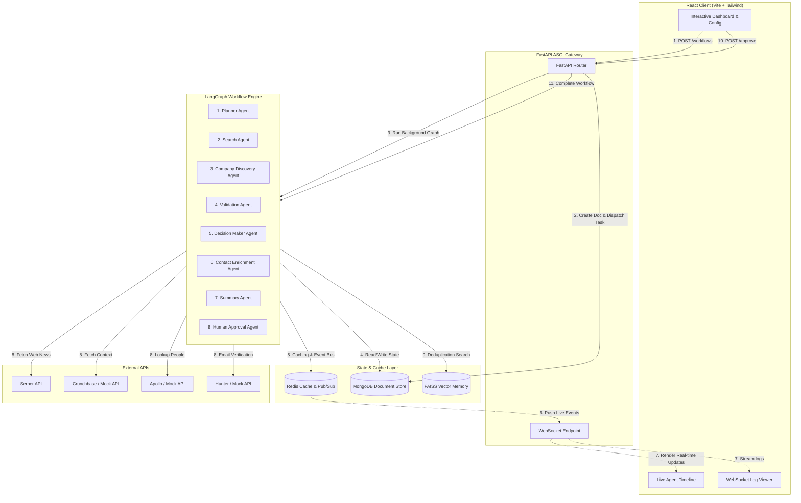

# AgentSphere AI

AgentSphere AI is an enterprise-grade agentic B2B customer discovery and prospect intelligence platform. By combining stateful multi-agent graphs with strict human-in-the-loop safety checkpoints, AgentSphere AI automatically identifies qualified target organizations, extracts relevant buying personas, enriches contact details, and compiles structured sales briefs.

🔗 **GitHub Repository:** [karthik5649/AgentShpereAI](https://github.com/karthik5649/AgentShpereAI)

## 👥 Team Details

| Roll Number | Name | Email |
| :--- | :--- | :--- |
| `23071A05J4` | P Karthik Reddy | [palakolukarthikreddy@gmail.com](mailto:palakolukarthikreddy@gmail.com) |
| `23071A05J6` | P Bharath | [potlabharath731@gmail.com](mailto:potlabharath731@gmail.com) |
| `23071A6636` | Kumbam Sathwik | [sathwikkumbum@gmail.com](mailto:sathwikkumbum@gmail.com) |

---

## 🏗️ Architecture Topology



---

## 🌟 Key Features

*   **Stateful Multi-Agent Workflows:** Orchestrates 8 specialized agent nodes using a state-sharing graph topology that allows conditional routing, fallback scenarios, and failure recovery.
*   **Real-time Log & Timeline Streaming:** Provides immediate feedback in the frontend with a live agent execution timeline and console log stream powered by WebSockets and a Redis Pub/Sub event bus.
*   **Human-in-the-Loop Safeguards:** Enforces an approval barrier where users can review, edit, reject, or approve discovered contacts before completing outbound workflows, keeping domain reputation safe.
*   **Qualitative Sales Briefings:** Summarizes findings into structured AI reports containing buying indicators, why-now context, customized outreach strategies, and target subject lines.
*   **Cost & Cache Optimization:** Tracks token usage per agent node in real-time. Employs local Redis caching and a FAISS semantic similarity index to prevent redundant web queries and keep LLM expenses minimal.
*   **Enterprise Integrations:** Exposes a modular FastAPI API gateway with Clerk JWT verification and a full Swagger UI document.

---

## 🛠️ Technology Stack

| Layer | Component | Description / Purpose |
| :--- | :--- | :--- |
| **Frontend** | React + TypeScript + Vite | Responsive, dark-mode single page app interface |
| **Styling** | Vanilla CSS + Tailwind | Glassmorphic, modern B2B SaaS theme design |
| **Backend** | FastAPI (Python) | High-performance asynchronous API, lifespan managers |
| **Queue & Graph** | LangGraph / asyncio | Stateful background workflow execution |
| **Primary Database**| MongoDB | Persistent state storage for runs, companies, and contacts |
| **Cache & Bus** | Redis | Caching, concurrent locks, and WebSocket Pub/Sub broker |
| **Vector Index** | FAISS / Pinecone | Cosine similarity semantic search memory for deduplication |
| **AI Models** | GPT-4o / Gemini 2.5 | Planner and Summary reasoning agents |
| **Data Scraping** | Serper, Crunchbase | Real-time news alerts and corporate validation |
| **Enrichment** | Apollo, Hunter | Person locator and verified work email matching |

---

## 📂 Project Directory Structure

```text
AgentSphereAI/
├── backend/                  # Python FastAPI API & Worker
│   ├── app/
│   │   ├── agents/          # Individual agent definitions
│   │   ├── core/            # Config, security, exceptions
│   │   ├── graph/           # State, execution graph schema
│   │   ├── memory/          # Cache (Redis), Mongo documents, Vector helper
│   │   ├── routers/         # API routes (Auth, Workflows, WebSockets)
│   │   ├── services/        # Service wrappers (Apollo, Hunter, Serper)
│   │   └── tools/           # Custom web tools
│   ├── scripts/             # run_api.sh & run_worker.sh
│   └── tests/               # Python pytest integration tests
├── frontend/                 # Vite React Application
│   ├── src/
│   │   ├── components/      # UI Layouts, Agents, Workflows, and Cards
│   │   ├── context/         # Auth contexts
│   │   ├── hooks/           # WebSocket hooks
│   │   ├── pages/           # Dashboard, Detail, History, Analytics pages
│   │   └── store/           # Zustand state management
│   └── tailwind.config.js
└── README.md                 # Root documentation
```

---

## 🤖 Detailed Multi-Agent Workflow Specification

AgentSphere AI breaks B2B discovery into a stateful, modular, multi-agent pipeline managed by a graph framework. The agents execute in the following order:

```text
Planner ➔ Search ➔ Company Discovery ➔ ICP Validation ➔ Decision Maker ➔ Contact Enrichment ➔ Summary ➔ Human Approval
```

### 1. Planner Agent
*   **Role:** Analyzes the target configuration (ICP parameters, persona requirements, and business triggers) to construct a localized query blueprint.
*   **Prompt Logic:** Outputs a structured JSON execution plan specifying:
    1.  The ordered list of agents to trigger.
    2.  Parallel execution groups (which sub-agents can run simultaneously).
    3.  Custom search queries tailored to locate the requested business signals.
    4.  ICP scoring weights used by the validation engine.
    5.  Estimated token budgets per node.
*   **Fallback:** If the LLM is unavailable, it generates a robust, deterministic local plan based on input configurations.

### 2. Search Agent
*   **Role:** Performs deep web scans to detect specified business events.
*   **Execution:** Integrates with the **Serper API** to search Google News and web indices.
*   **Caching & Optimization:** Caches raw search snippets in Redis with a **24-hour Time-To-Live (TTL)** to avoid duplicate searches and control external API costs.
*   **Triggers Monitored:** Regex patterns and semantic matches identify trigger signals: `funding_round`, `headcount_growth`, `new_executive`, `product_launch`, and `expansion`.

### 3. Company Discovery Agent
*   **Role:** Extracts organization details from crawled results.
*   **Integrations:** Uses mock databases or direct Crunchbase APIs to pull domain references, headcount ranges, and headquarters location.
*   **Deduplication:** Acquires distributed Redis locks per company domain to avoid concurrent duplicate crawls. It runs lookups against the local FAISS index; if a match exists with a similarity above `0.90`, the domain is skipped.

### 4. ICP Validation Agent
*   **Role:** Computes a qualification ranking score between `0.0` and `1.0`.
*   **Algorithmic Scoring:**
    $$\text{ICP Score} = (\text{Industry Match} \times 0.25) + (\text{Headcount} \times 0.20) + (\text{Funding Stage} \times 0.20) + (\text{Geography} \times 0.15) + (\text{Revenue} \times 0.10) + (\text{Tech Stack} \times 0.10)$$
*   **Qualification Cutoff:** Only companies achieving an **ICP match score $\ge 0.65$** are promoted to the database.
*   **Semantic Memory:** Vectorizes the company description and saves the embedding in FAISS/Pinecone.

### 5. Decision Maker Agent
*   **Role:** Scrapes and filters professional social structures for target leads.
*   **Seniority Ranks:** Matches and ranks titles by hierarchical weight:
    $$\text{C-Suite} > \text{VP} > \text{Director} > \text{Manager} > \text{Individual Contributor}$$
*   **Limit:** Pinpoints the top 2-3 most relevant prospects per qualified organization.

### 6. Contact Enrichment Agent
*   **Role:** Enriches leads with verified communications.
*   **Integrations:** Interfaces with the **Hunter API** (work email verification) and **Apollo API** (phone numbers and LinkedIn profiles).
*   **Caching:** Enriched results are cached in Redis for **12 hours**. All leads are saved in MongoDB with an initial approval state of `pending`.

### 7. Summary Agent
*   **Role:** Generates tailored sales pitch context.
*   **Output:** Creates a detailed sales intelligence briefing containing:
    *   **Why-Now Trigger:** Detailed context on the news signal detected.
    *   **Outreach Strategy:** Targeted positioning ideas.
    *   **Draft Communications:** Tailored cold email templates and subject lines.

### 8. Human Approval Agent
*   **Role:** Controls the HIL (Human-In-The-Loop) safety barrier.
*   **Behavior:** Pauses execution, flags the workflow status as `awaiting_approval`, and sends an `approval_required` WebSocket event. Once a human submits decisions (Approve, Reject, or Edit), the workflow completes.

---

## 💾 Infrastructure & Database Schemas

### 1. MongoDB Collections

#### Collection: `workflows`
Tracks execution state, aggregate token consumption, and target constraints.
```json
{
  "_id": "wf_65a4c9b1e2c3d4f5",
  "user_id": "user_2Yh39Ksl92",
  "session_id": "sess_9b3c4f217d89",
  "name": "Q3 SaaS Outbound",
  "status": "awaiting_approval",
  "icp": {
    "industry": ["SaaS", "Fintech"],
    "headcount_min": 50,
    "headcount_max": 250,
    "geographies": ["US", "CA"],
    "tech_stack": ["React", "Node"]
  },
  "personas": [
    { "title": "VP Engineering", "priority": 1 },
    { "title": "CTO", "priority": 2 }
  ],
  "triggers": ["funding_round"],
  "total_tokens": 42910,
  "total_cost_usd": 0.0858,
  "summary_report": {
    "summary": "Identified 3 companies with recent Series A announcements...",
    "why_now": "Funding announcements indicate budget expandability.",
    "outreach_strategy": "Focus on engineering scaling solutions.",
    "subject_lines": ["Scaling engineering at {{company_name}}", "Series A resources"]
  },
  "created_at": "2026-06-30T14:55:00Z"
}
```

#### Collection: `companies`
Stores validated customer targets.
```json
{
  "_id": "comp_a8b9c0d1e2f3",
  "workflow_id": "wf_65a4c9b1e2c3d4f5",
  "user_id": "user_2Yh39Ksl92",
  "name": "Stripe",
  "domain": "stripe.com",
  "industry": "Fintech",
  "headcount": 180,
  "funding_stage": "Series B",
  "geography": "US",
  "tech_stack": ["React", "AWS", "Node"],
  "icp_match_score": 0.95,
  "business_description": "Online payment processor...",
  "triggers_detected": ["funding_round"]
}
```

#### Collection: `contacts`
Tracks enriched buyer profiles.
```json
{
  "_id": "cont_9d8e7f6a5b4c",
  "workflow_id": "wf_65a4c9b1e2c3d4f5",
  "company_id": "comp_a8b9c0d1e2f3",
  "user_id": "user_2Yh39Ksl92",
  "name": "John Doe",
  "title": "VP Engineering",
  "email": "j.doe@stripe.com",
  "phone": "+1-555-0199",
  "confidence_score": 0.94,
  "approval_status": "pending", // pending, approved, rejected
  "linkedin_url": "https://linkedin.com/in/johndoe"
}
```

### 2. Redis Caching & Event Keys
Redis is used for lock synchronization, REST request caching, and Pub/Sub routing.

| Key Pattern | Data Type | Purpose | TTL |
| :--- | :--- | :--- | :--- |
| `cache:search:{query_hash}` | String | Google News search result caching | 24 Hours |
| `cache:contact:{domain}:{name_hash}` | String | Hunter/Apollo lookup responses | 12 Hours |
| `lock:company:{domain}` | String | Lock context preventing concurrent crawls | 5 Seconds |
| `session:{session_id}:context` | Hash | In-memory LLM conversation context buffer | 1 Hour |
| `workflow:{workflow_id}:events` | Channel | Pub/Sub topic streaming live events | Real-time |
| `workflow:{workflow_id}:event_buffer`| List | WebSocket reconnect backpressure buffer | 10 Minutes |

### 3. FAISS Vector Database Memory
*   **Embeddings Model:** Vectorized using OpenAI's `text-embedding-3-small` (or local hashed fallback).
*   **Cosine Similarity Threshold:** Set to `0.90` for duplicate checks.
*   **Metadata Saved:** Saves `{name, domain, industry, workflow_id, user_id}` as JSON payload inside the index mapping.

---

## 🔌 API Gateway Documentation

AgentSphere AI exposes asynchronous REST routes and WebSockets.

### 1. REST Endpoints

#### Authentication Router (`/api/v1/auth`)
*   `POST /auth/signup` - Registers a new user. Expects `{name, email, password}`. Returns JWT token.
*   `POST /auth/login` - Authenticates user. Expects `{email, password}`. Returns JWT token.
*   `GET /auth/me` - Retrieves payload profiles of current logged-in identity.

#### Workflow Router (`/api/v1/workflows`)
*   `POST /workflows` - Dispatches a workflow loop. Accepts `CreateWorkflowRequest`. Returns `CreateWorkflowResponse`.
*   `GET /workflows` - Paginated lists of active and past runs.
*   `GET /workflows/{workflow_id}` - Detailed object view including companies, contacts, and logs.
*   `POST /workflows/{workflow_id}/approve` - Submits human approval decisions. Accepts array of `{contact_id, action: "approve"|"reject"|"edit", email: string}`.

#### Memory Router (`/api/v1/memory`)
*   `GET /memory/stats` - Pulls indexing statistics of document count and vector memory.
*   `POST /memory/search` - Runs vector queries against FAISS. Expects `{query}`. Returns matching nodes and cosine scores.
*   `POST /memory/session/clear` - Clears session caches.

---

## 📡 WebSocket Event Protocol

Real-time timeline states and agent console logs stream over WebSockets (`ws://localhost:8000/api/v1/ws/{workflow_id}`).

### Event Message Schema
Every event conforms to this base JSON interface:
```json
{
  "event_type": "agent_started" | "agent_progress" | "agent_completed" | "agent_error" | "approval_required" | "workflow_completed",
  "timestamp": "2026-06-30T14:55:02.124Z",
  "data": {}
}
```

#### Event: `agent_started`
Fired when a graph node becomes active.
```json
{
  "event_type": "agent_started",
  "timestamp": "2026-06-30T14:55:01.000Z",
  "data": { "agent_name": "search_agent" }
}
```

#### Event: `agent_progress`
Streams intermediate scraping or score calculations.
```json
{
  "event_type": "agent_progress",
  "timestamp": "2026-06-30T14:55:05.000Z",
  "data": {
    "agent_name": "validation_agent",
    "message": "Scoring vercel.com against ICP parameters. Score computed: 0.85"
  }
}
```

#### Event: `agent_completed`
Fired upon node success. Includes cost tracking.
```json
{
  "event_type": "agent_completed",
  "timestamp": "2026-06-30T14:55:08.000Z",
  "data": {
    "agent_name": "planner_agent",
    "tokens_used": 14205,
    "cost_usd": 0.0284,
    "message": "Planner produced execution plan"
  }
}
```

#### Event: `approval_required`
Pauses the graph at the HIL gate.
```json
{
  "event_type": "approval_required",
  "timestamp": "2026-06-30T14:55:12.000Z",
  "data": { "workflow_id": "wf_65a4c9b1e2c3d4f5", "pending_count": 3 }
}
```

---

## 🚀 Quick Start Guide

### 1. Prerequisites
Ensure you have **MongoDB** and **Redis** running locally:
```bash
# Start MongoDB (macOS Homebrew example)
brew services start mongodb-community

# Start Redis
brew services start redis
```

### 2. Configure Environment Variables
*   **Backend:** Create `backend/.env` copying from `backend/.env.example`.
*   **Frontend:** Create `frontend/.env.local` copying from `frontend/.env.example`.

*Example backend config (`backend/.env`):*
```env
APP_ENV=development
SECRET_KEY=dev_secret_key_123
MONGODB_URI=mongodb://localhost:27017
MONGODB_DB_NAME=agentsphere
REDIS_URL=redis://localhost:6379/0

# Optional keys for production crawls:
OPENAI_API_KEY=sk-...
SERPER_API_KEY=...
APOLLO_API_KEY=...
HUNTER_API_KEY=...
```

### 3. Install & Start Backend
Launch the API and Worker in separate shell sessions:
```bash
cd backend

# Setup Python Virtual Environment (Python 3.11 recommended)
python3.11 -m venv venv
source venv/bin/activate
pip install -r requirements.txt

# Tab 1: Run FastAPI Web Server
./scripts/run_api.sh

# Tab 2: Run Worker process (if using Celery)
./scripts/run_worker.sh
```

### 4. Install & Start Frontend
Launch the Vite React client in a separate terminal:
```bash
cd frontend
npm install
npm run dev
```
Open [http://localhost:5173](http://localhost:5173) in your browser.

---

## 🧪 Testing Suite
The backend contains automated validation coverage.
```bash
cd backend
# Run pytest suites for agent states, database routers, and validation models
pytest tests/
```
